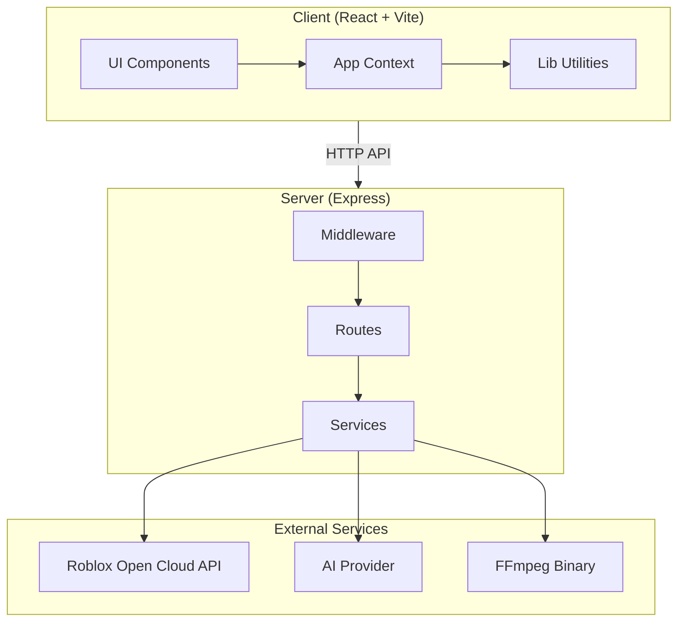
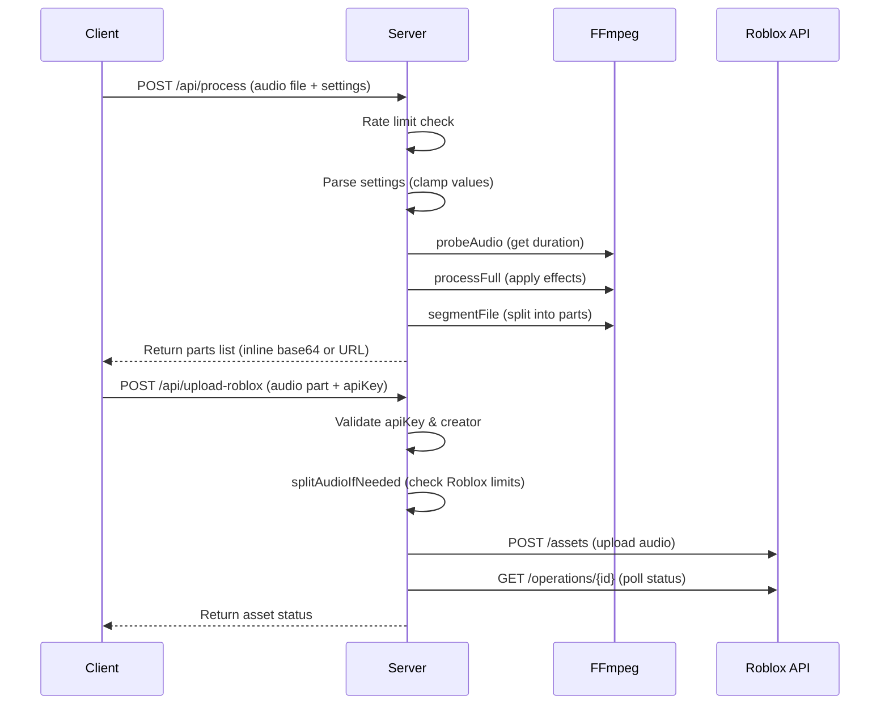
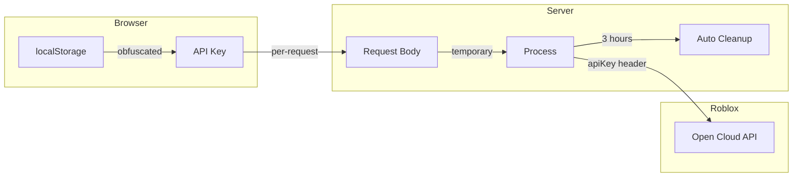

# Architecture

## System Overview



## Components

### Client (Frontend)

**Stack:** React 18, Vite, lucide-react (ikon), CSS biasa (`src/styles.css`) — tanpa Tailwind/framer-motion

**Structure:**
- `main.jsx` — Bootstrap React ke `#root` + registrasi service worker (PWA)
- `App.jsx` — Root component, Context Provider, routing antar halaman, banner kesehatan backend
- `pages/` — Halaman (Dashboard, ConvertPage, LibraryPage, HistoryPage, SettingsPage)
- `components/` — Komponen UI reusable (`ui.jsx`, Hero, Skeleton)
- `lib/` — Helper murni: `api.js` (fetch + retry/timeout), `storage.js`, `jobsPersist.js`,
  `format.js`, `utils.js`, `zip.js` (ZIP writer tanpa dependency), `doneChime.js`, `constants.js`
- `ErrorBoundary.jsx` — Graceful error handling di level React
- `test/` — Unit test Vitest (31 test) untuk helper murni

**State Management:**
- React Context API untuk global state
- localStorage untuk persistence (roblox config, history, settings)
- No external state library (Context + hooks cukup untuk skala ini)

**Key Design Decisions:**
- Lazy loading pages berat (chunk ConvertPage ~30KB) untuk initial load cepat
- Navigasi antar seksi memakai `scrollIntoView` (smooth) dari nav — tanpa scroll-spy observer
- API key Roblox di-obfuscate sederhana di localStorage (defense-in-depth)
- ErrorBoundary untuk graceful error handling

### Server (Backend)

**Stack:** Express, FFmpeg (`fluent-ffmpeg` + `ffmpeg-static`), Multer, Axios, yt-dlp (opsional)

**Structure:**
- `server.js` — Entry point, middleware, security headers, auto-cleanup, graceful shutdown
- `routes/` — API endpoints (`audio.routes.js`, `ai.routes.js`)
- `services/` — Business logic (`ffmpeg`, `roblox`, `youtube`, `ai`, `taskQueue`)
- `lib/` — `logger.js`, `progressStore.js` (persen progres), `uploadsDir.js`
- `middleware/` — `rateLimit.js`, `observability.js` (request log, metrik, token guard)
- `test/` — Unit + integration test Vitest (92 test)

**Request Flow:**


### FFmpeg Pipeline

**Processing Steps:**

1. **Probe** — Baca metadata sumber (duration, codec, streams)
2. **Build Filters** — Susun FFmpeg audio filter chain:
   - `asetrate` + `aresample` (pitch shift)
   - `rubberband` (speed change berkualitas, formant dipertahankan; fallback `atempo` bila binary tidak mendukung)
   - `volume` (amplify/attenuate)
   - `equalizer` (EQ presets, bass boost)
   - `aecho` (reverb, echo)
   - `loudnorm` (normalize)
   - `afade` (fade in/out)
   - `aresample=44100` (final sample rate)
3. **Convert** — Run FFmpeg dengan filter chain + encoder (default libmp3lame → MP3)
4. **Fallback** — Jika gagal, coba tanpa efek berat, lalu minimal (tempo+volume)
5. **Segment** — Potong output jadi parts dengan `-f segment`

**Fallback Strategy:**
```
Full filters → Level 1 (tanpa normalize/reverb/echo) → Minimal (tempo + volume)
```

### Roblox Integration

**Upload Flow:**
1. Validasi ukuran & durasi vs limit Roblox
2. Split jika melebihi limit (durasi max 420s, size max 19MB)
3. POST ke `apis.roblox.com/assets/v1/assets` dengan multipart form
4. Poll `apis.roblox.com/assets/v1/operations/{id}` sampai `done=true`
5. Return status: Accepted / Pending / Failed

**Retry Strategy:**
- Retry pada 429 (rate limit) dan 5xx (server error)
- Max 2 retries dengan exponential backoff
- Non-retryable: 400, 401, 403, 413

## Security Model



**Key Principles:**
- **No login/sessions** — API key dikirim per-request, tidak disimpan di server
- **No database** — Semua data user di localStorage browser
- **API key obfuscation** — Sederhana XOR/base64 di localStorage (bukan encryption)
- **Path traversal protection** — File serving memakai `path.basename()` + resolve check
- **Security headers** — CSP, HSTS, X-Frame-Options, X-Content-Type-Options, Referrer-Policy, Permissions-Policy
- **Rate limiting** — Per-endpoint, mencegah abuse
- **File cleanup** — Auto-delete uploads >3 jam
- **CORS** — Terbuka default (aman karena no session), bisa dibatasi via env

## Performance Considerations

### Client
- **Code splitting** — Lazy load pages berat
- **IntersectionObserver** — Efficient active section tracking
- **memo()** — Cegah re-render komponen statis
- **Inline base64** — Audio <8MB inline untuk hemat request, >8MB via URL

### Server
- **Task Queue** — Konversi & upload di-queue (concurrency configurable)
- **Single probe** — Probe sumber sekali, pass ke service (hindari double-probe)
- **Compression** — gzip semua response kecuali base64 audio (X-No-Compression)
- **Static caching** — Hash assets immutable cache, index.html no-cache
- **Graceful shutdown** — Drain connections sebelum exit

### FFmpeg
- **rubberband (formant preserved)** — Time-stretch berkualitas tinggi; fallback atempo
- **libmp3lame VBR ~V2** — Encoder default (kualitas tinggi, kompatibel Roblox); `AUDIO_FORMAT=ogg` → libvorbis 160k
- **44100 Hz** — Sample rate standar
- **Segment filter** — Split cepat tanpa re-encode ulang
- **Timeout** — 30 menit max per konversi (FFMPEG_TIMEOUT_MS)

## Deployment

**Single Container:**
- Express serve both API + static client (built by Vite)
- Port 7860 (Hugging Face default)
- FFmpeg binary dari `ffmpeg-static` npm package

**Environment Variables:**
- `PORT` — Server port (default 4000)
- `CLIENT_DIST` — Path ke built client (serve SPA)
- `MAX_UPLOAD_MB` — Max upload size (default 250)
- `CONVERSION_CONCURRENCY` — Parallel conversions (default 2)
- `ALLOWED_ORIGINS` — CORS whitelist (comma-separated)
- `AI_API_KEY`, `AI_MODEL`, `AI_BASE_URL` — AI integration
